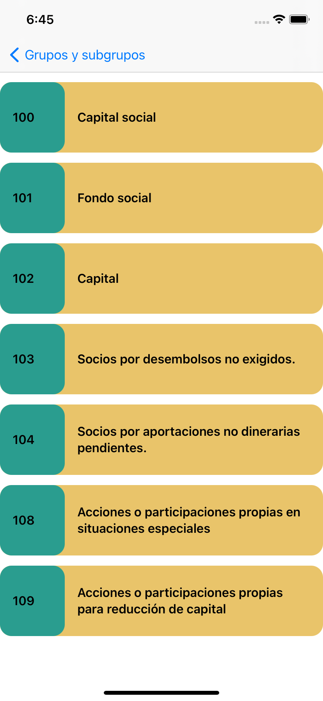
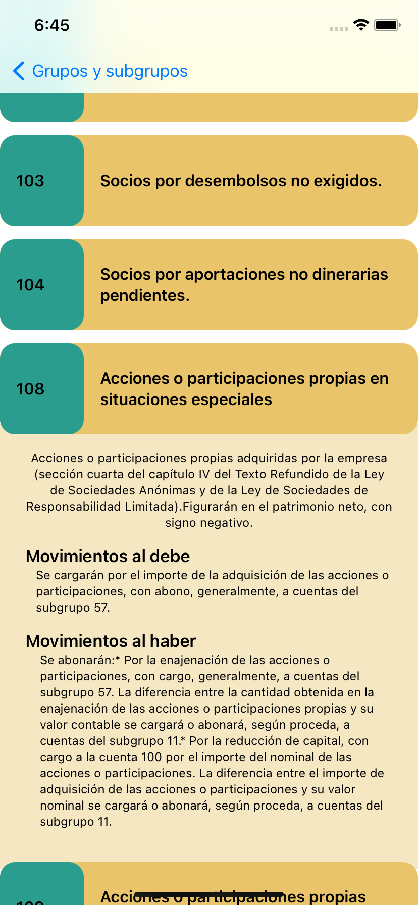

# PlanGeneralContable_SwiftUI
#Pequeño diccionario del Plan General Contable 2008

Agrupa todas las cuentas con su definición y codificación.

#Done:
  - Json local file reading
  - Custom path shape

#TODO:
  - Add examples to each account sign
  - show groups and subgroups definitions
  - Implement feateure: add user's custom note.
  
  
  
  
  
